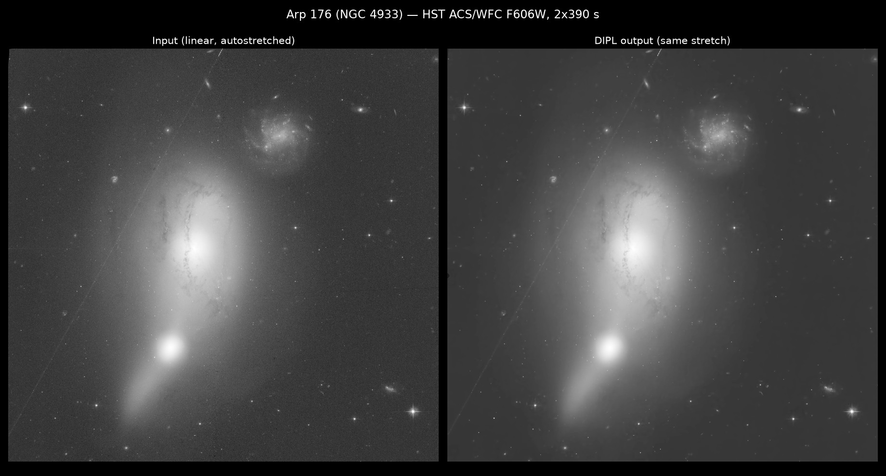
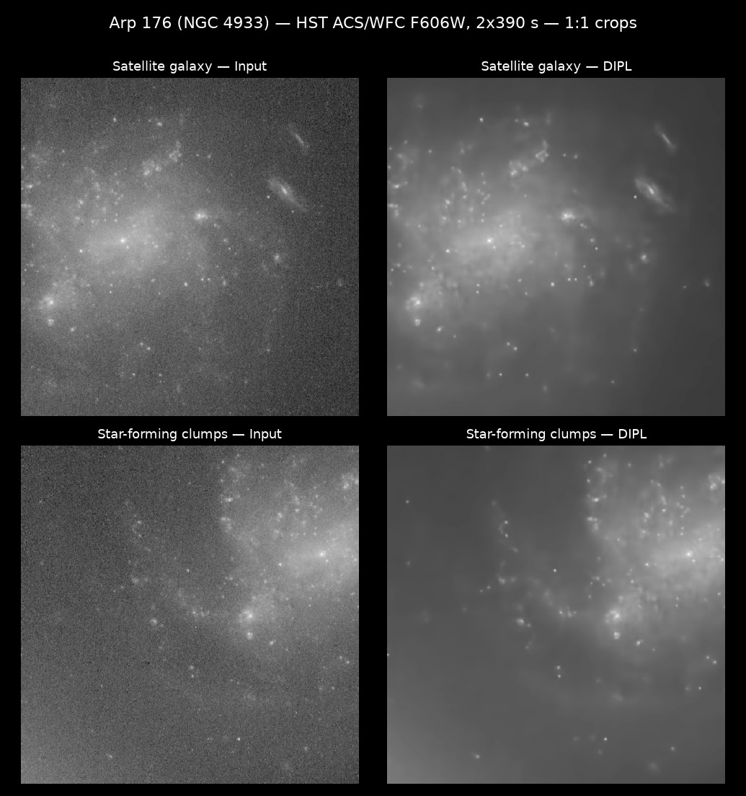
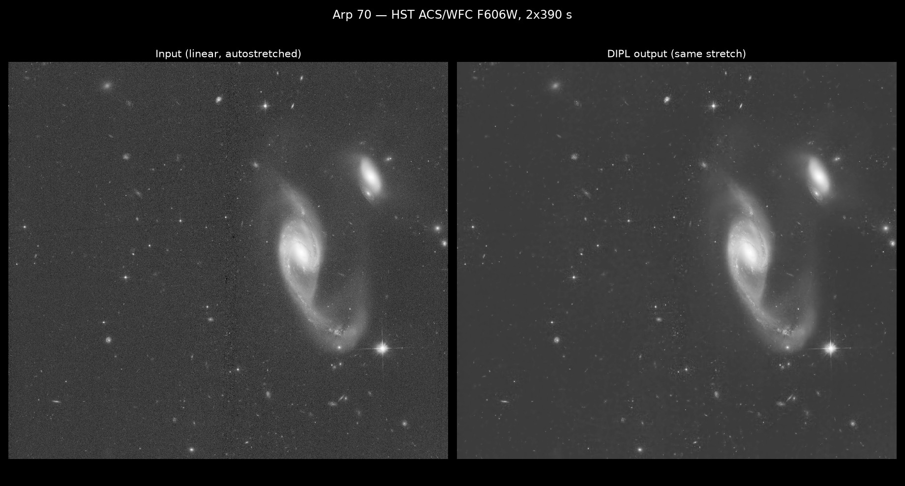
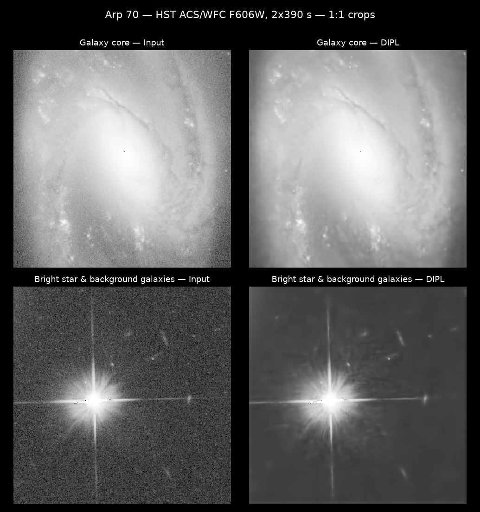
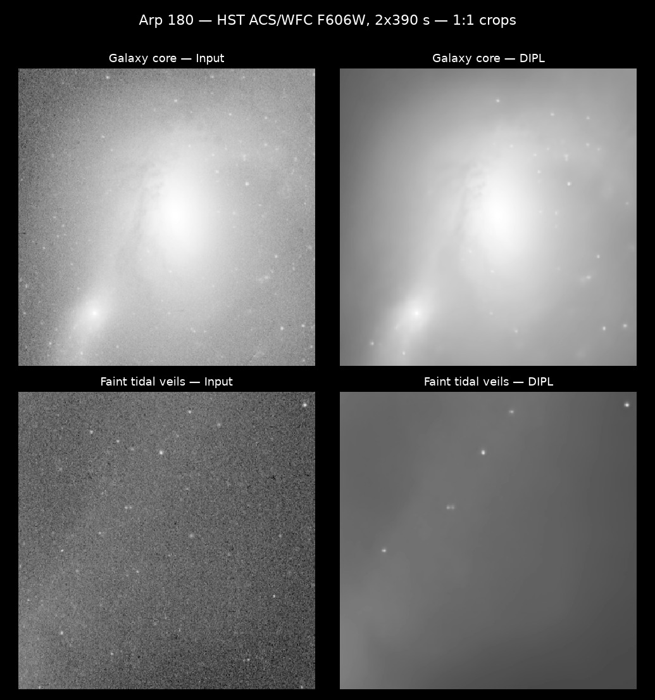
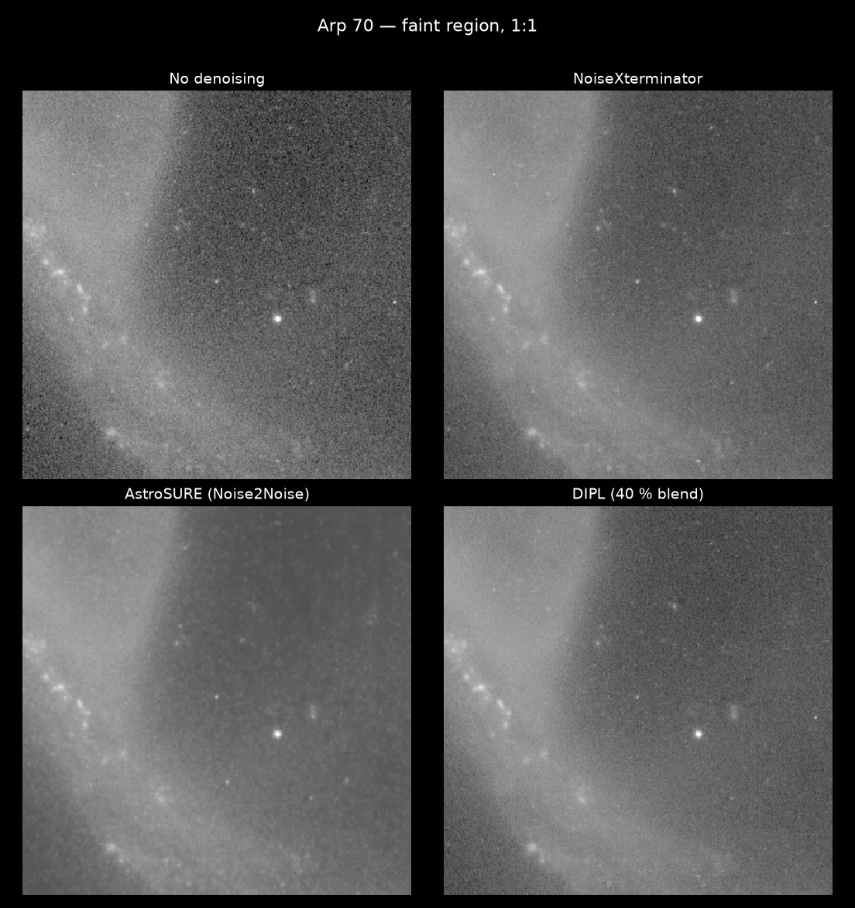

# DIPL: Deep Image Prior Linear

Deep Image Prior denoising that finally works on **linear** (unstretched)
astronomical images, full frame, with photometry preserved.

No training data, no pre-trained model, no internet: a randomly-initialized
U-Net is fitted to *your single image*, and stopped at the exact moment it
has learned the structure but not yet the noise.




*Arp 176 (NGC 4933), HST ACS/WFC, 2×390 s in F606W, the hardest field
of the series: it used the full 25 000-iteration budget. Same
autostretch on both panels, computed on the input. Star-forming clumps
and tidal debris come out of the grain intact, and the satellite trail
in the full frame survives untouched: real structure stays, only the
noise goes.*




*Arp 70, stopped by ES-WMV at iteration 23 935. Spiral structure, HII
regions, diffraction spikes and background galaxies all survive.*



*Arp 180, the field that motivated this work: its tidal veils sit just
under the noise floor of a 2×390 s pair and no conventional denoiser
could recover them convincingly. Stopped by ES-WMV at iteration 18 124.*



*Same field, four strategies: nothing, NoiseXterminator, AstroSURE (a
Noise2Noise net trained on HST exposure pairs), DIPL blended at 40 %.
For a fair comparison every panel is affine-matched to the reference
photometric frame (fit on galaxy-body pixels) and displayed with the
same MTF autostretch computed on the reference. Full-frame and
galaxy-core versions: [full](docs/img/arp70_4methods_full.jpg),
[core](docs/img/arp70_4methods_zoom_core.jpg).*

## Why this repo exists

[Deep Image Prior](https://arxiv.org/abs/1711.10925) (Ulyanov et al. 2018)
is a beautiful idea that, in practice, fails on real astronomical data. I
have been trying to make it work for seven years: it only ever succeeded on
stretched images and small crops. On linear data the loss is dominated by a
handful of bright pixels, the noise is Poisson-Gaussian rather than white,
and without a ground truth you never know when to stop the fit, which is
the entire game with DIP.

Three ingredients unlocked it:

1. **Variance stabilization (GAT).** The loss is computed after a
   Generalized Anscombe Transform, so the signal-dependent Poisson-Gaussian
   noise of a linear image becomes approximately unit Gaussian. The MSE
   stops being a competition between the galaxy core and everything else.
2. **Self-referenced early stopping (ES-WMV).** The windowed moving
   variance of the network output detects the structure-to-noise
   transition without any ground truth
   ([Wang et al., TMLR 2023](https://arxiv.org/abs/2112.06074)), plus a
   warm-up guard against early false minima.
3. **Full-frame optimization.** No tiles, no seams. A 16 Mpx HST frame
   fits in ~135 GB of VRAM (one H200); smaller images run on consumer
   GPUs or Apple Silicon (MPS).

Everything stays linear end to end. The output keeps the input's dynamic
range and photometry, and every run writes a JSON sidecar with all
parameters and the selected iteration.

## Install

```bash
pip install -r requirements.txt   # torch, astropy, xisf, scipy, matplotlib
```

Works on **NVIDIA GPUs (CUDA)** and **Apple Silicon (MPS)** with the same
command: the device is auto-detected (MPS → CUDA → CPU), there is no flag
to set. Install the regular PyTorch build for your platform and you are
done. Development and all small-image validation were done on a Mac
Studio (M2 Max); the full-frame HST runs on an NVIDIA H200. CPU works
too, for small tests only.

## Use

```bash
python denoise_astro_v4_mse.py your_linear_image.xisf -o denoised.fits \
    -i 18000 --percentiles 0.5 99.99 --psnr-interval 100 \
    --es-patience 4000 --es-min-start 1500 --grad-clip 1.0 --seed 42
```

Reads FITS / XISF / TIFF (mono). Writes the denoised FITS plus a JSON
sidecar and two PNG plates (before/after comparison, convergence curve).
These flags are the exact recipe used for every image on this page.

## Recommended workflow

Run DIPL on your linear image after gradient removal (DBE or equivalent),
**then blend some of the original back**. This final blend is part of the
method, not an option: pure DIP output is essentially noise-free (÷100 or
more), which looks synthetic. A convex blend keeps a natural grain and is
photometry-safe:

```
final = a * DIPL + (1 - a) * original      # PixelMath, linear space
```

After trying several ratios on the HST series, **`a = 0.55` is the best
compromise** (45 % of the original noise kept, noise ÷2.2): the images
stay perfectly natural while the faint structures hold. `a = 0.75`
(noise ÷4) is the aggressive setting for very faint veils. Stretch and
sharpen afterwards as usual.

## What to expect (real runs, HST ACS/WFC, one H200)

| Field   | Mpx  | Stop iteration      | Wall time |
|---------|------|---------------------|-----------|
| Arp 70  | 15.4 | 23 935 (early stop) | 4 h 52    |
| Arp 180 | 14.9 | 18 124 (early stop) | 3 h 34    |
| Arp 176 | 15.5 | 25 000 (cap)        | 6 h 10    |
| Arp 255 | 16.0 | 14 605 (early stop) | 5 h 31    |
| Arp 293 | 15.8 | 18 000 (cap)        | 6 h 32    |

Background noise on these runs drops by a factor ~100 or more before
blending; bright-star photometry stays within a fraction of a percent
(saturated cores are re-injected from the input). The JSON sidecar of
every run above is in [`docs/runs/`](docs/runs/): every parameter,
the selected iteration, the timings.

## Honest limits

- **It is slow.** DIP fits a network per image; hours per frame at HST
  scale. This is a quality tool, not a batch tool.
- **VRAM scales with area.** ~9 GB per Mpx at full frame. Use
  `denoise_astro_tiled.py` when the frame does not fit, and read its
  docstring first: tiles can converge to different smoothness levels.
- Tested on mono images. Process color channels separately.
- A cap of 18 000 to 25 000 iterations with ES patience 4 000 has been the
  sweet spot on 15 Mpx HST frames; smaller images stop much earlier.

## Files

- `denoise_astro_v4_mse.py`: main engine (GAT loss, ES-WMV, grad clip)
- `denoise_astro_v3.py`: earlier asinh-space engine, kept for reference
- `denoise_astro_tiled.py`: tiled fallback for VRAM-limited machines
- `check_noise_whiteness.py`: QC helper: is your residual actually noise?
- `models/`, `utils/`: network zoo (from the original DIP repo) and
  I/O / early-stopping / validation helpers

## Credits

- D. Ulyanov, A. Vedaldi, V. Lempitsky,
  [Deep Image Prior](https://arxiv.org/abs/1711.10925), the original idea
  and the network implementations in `models/` (Apache 2.0, see
  `NOTICE.md`).
- H. Wang, T. Li, Z. Zhuang, T. Chen, H. Liang, J. Sun,
  [Early Stopping for Deep Image Prior](https://arxiv.org/abs/2112.06074)
  for the ES-WMV criterion.
- Hubble data: program SNAP-15446 (PI J. Dalcanton), via MAST.

My earlier notebook-era attempts live at
[DeepPrior_for_Astro](https://github.com/BB-Astro/DeepPrior_for_Astro);
this repo supersedes them.

MIT License (see `LICENSE` and `NOTICE.md`).
